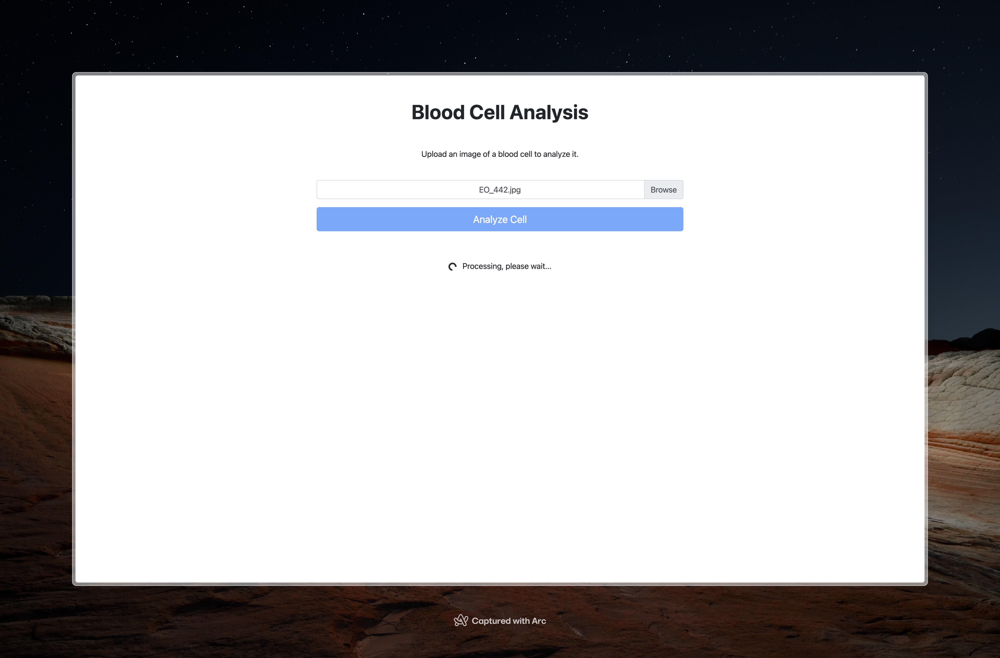
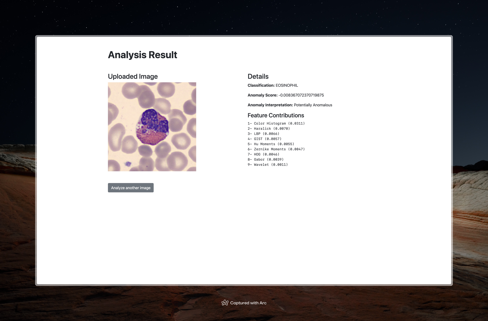

# Hemo Lens: Blood Cell Analysis Pipeline

Detecting the type of blood cell in microscopic images is a common task in laboratories. This project aims to classify blood cell images into eight categories, and furthermore use models to detect anomalies in the images. The vision of this project is to demonstrate a tool used by lab technicians to classify and blood cells based on specific image features.

In this project, machine learning models and image processing techniques are used to classify blood cell images into classification classes and flag anomalies in the images. By staying away from neural networks, the project highlights the use of classical features, which can be crafted specifically for each case by experts, and their potential to achieve meaningful results.

This exploration covers data preprocessing, feature selection and extraction, model comparison, and the deployment of the best model in a Flask web app for real-time analysis.

## App Demo

Inputting blood cell image:



Analysis results:



## Data

The dataset used in this project is sourced from 17000 blood cell images, using the analyzer CellaVision DM96 in the Core Laboratory at the Hospital Clinic of Barcelona. The dataset is available in the `Data` folder and can also be downloaded from [Kaggle](https://www.kaggle.com/datasets/unclesamulus/blood-cells-image-dataset).

## Usage

To run the project, first clone the repository:

```bash
git clone https://github.com/SepehrAkbari/hemolens.git
cd hemolens
```
Install the required libraries:

```bash
pip install -r requirements.txt
```

To explore the analysis, run the Jupyter Notebook located in the `notebook` folder:

```bash
Jupyter notebook notebooks/hemolens.ipynb
```

To launch the Flask app:

```bash
cd app
flask run
```

## Computation Consideration

Sections of the project notebook which include code for data cleaning and feature extraction, are extremely computationally expensive. The recommended approach is to run sections 2.3, 6, and one's marked by commented code, on a GPU enabled cluster computing environment.

## Approach

Our methodology involved a comprehensive pipeline starting with data preprocessing, where a representative sample of images was curated, and meticulous image segmentation was performed using filtering and morphological operations to isolate blood cells from the background, ensuring data quality for subsequent analysis. Following this, feature extraction was conducted, deriving a set of nine distinct features from the segmented cells, which were then consolidated into a robust feature vector for machine learning tasks. This prepared data was then used for model comparison, evaluating various classification algorithms across multiple performance metrics to identify the optimal classifier for the task. We finally decided to use a tree-based ensemble method with XGBoost.

The project further extended into anomaly detection, employing an Isolation Forest model to identify unusual patterns within the blood cell images, and subsequently focused on model explainability using LIME to interpret the predictions of the chosen classifier, providing insights into feature importance. Finally, the entire analytical pipeline, encompassing the selected classification model, anomaly detection, and explainability tools, was deployed via a Flask web application, enabling real-time analysis and reporting for new blood cell image inputs.

## Contributing

To contribute to this project, you can fork this repository and create pull requests. You can also open an issue if you find a bug or wish to make a suggestion.

## License

This project is licensed under the [GNU General Public License (GPL)](/LICENSE).
