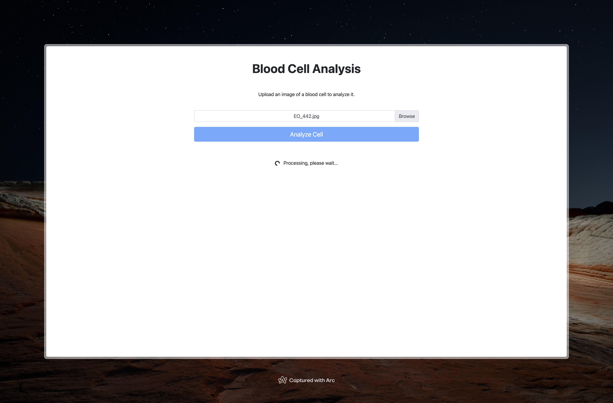

# Blood Cells Analysis Model

Detecting the type of blood cell in microscopic images is a common task in laboratories. This project aims to classify blood cell images into eight categories, and furthermore use models to detect anomalies in the images. The vision of this project is to demonstrate a tool used by lab technicians to classify and blood cells based on specific image features.

In this project, machine learning models and image processing techniques are used to classify blood cell images into classification classes and flag anomalies in the images. By staying away from neural networks, the project highlights the use of classical features, which can be crafted specifically for each case by experts, and their potential to achieve meaningful results.

This exploration covers data preprocessing, feature selection and extraction, model comparison, and the deployment of the best model in a Flask web app for real-time analysis.

## App Demo

Inputting blood cell image:



Analysis results:


## Data

The dataset used in this project is sourced from 17000 blood cell images, using the analyzer CellaVision DM96 in the Core Laboratory at the Hospital Clinic of Barcelona. The dataset is available in the `Data` folder and can also be downloaded from [Kaggle](https://www.kaggle.com/datasets/unclesamulus/blood-cells-image-dataset).

## Usage

To run the project, first clone the repository:

```bash
git clone https://github.com/SepehrAkbari/BloodCells
cd BloodCells
```

Install the required libraries:

```bash
pip install -r requirements.txt
```

To explore the analysis, run the Jupyter Notebook located in the `Notebook` folder:

```bash
jupyter notebook Notebooks/main.ipynb
```

To launch the Flask app:

```bash
flask run
```

## Computation Consideration

Setions of the project notebook which include code for data cleaning and feature extraction, are extremely computationally expensive. The recommended appraoch is to run sections 2.3, 6, and one's marked by commented code, on a GPU enabled cluster computing environment.

## Approach

- **Data Preprocessing:** 

  - A small portion of the original dataset was dropped due to inconsistencies.

  - The original dataset contained about 17000 images, or about 2000 images per class. A sample of 500 images was obtained from each class to reduce the computational complexity of the project.

  - Image normalization was tested, but did not perform well due to the importance of color in the images for our feature extraction.

  - Image segmentation was performed to separate the background from the blood cells, by first applying median and Gaussian filters, and creating a mask using Otsu's thresholding method, and morphological operations.  

- **Feature Extraction:**

    - Nine features were selected for the classification task.

    - The features were extracted and formed a large feature vector, later used for model training.

- **Model Comparison:** 

  - Compared models including Logistic Regression, K-Nearest Neighbors, Linear and Kernel SVM, Random Forest, AdaBoost, and XGBoost.

  - Models were evaluated using metrics like MSE, R-squared, accuracy, precision, recall, and F1 score. The classification report and confusion matrix were also used to evaluate the models on a class basis.

  - The XGBoost model was selected as the best performing model, achieving an F1 score of 89%.

- **Detecting Anomalies:**

  - Isolation Forest model with a contamination rate of 0.05 was used to detect anomalies in the images.

  - Using the model's decision function, each image was assigned an anomaly score.

  - Positive scores were decided to be considered normal, while negative scores were considered potential anomalies in this project.

- **Model Explainability:**

    - LIME Tabular Explainer was used to explain the predictions of the XGBoost model.

    - The explainer was applied to the all columns. Each column was later grouped into its respective feature category, and the total, count and mean of the feature importance was calculated.

    - All features were listed in order of influence on the model's predictions, with their mean importance displayed.

- **Deployment:** 

  - The XGBoost, IsolationForest, and LIME Explainer, were deployed via a Flask web app, allowing administrators to input blood cells images and receive real-time analysis reports.

## Theoratical Explanation

Functions used for Segmentation, and all feature extractions are explained in the `Notebooks` folder in detail. Here is a brief summary of each:

- **Segmentation:** In this project, we will perform segmentation through a technique called thresholding. Specifically, using the Otsu thresholding method. Thresholding is a common preprocessing technique for images wherein a grayscale image is binarized based on pixel intensities. If the intensity of an input pixel is greater than the threshold, the corresponding output pixel is marked as white (foreground), and if the input pixel is less than or equal to the threshold, the output pixel location is marked black (background). The Otsu method is an adaptive thresholding technique that automatically calculates the optimal threshold value based on the image's histogram.

- **Color Histogram:** A color histogram is a frequency distribution of pixel intensity values, used to represent the color composition of an image. 

- **Histogram of Oriented Gradients (HOG):** HOG is a feature descriptor that analyzes local pixel gradient magnitudes and orientations, then aggregates them over larger spatial regions. Working on a grayscale image, the gradient of each pixel is computed using Sobel filters, outputting the horizontal and vertical directions respectively.

- **Local Binary Patterns (LBP):** LBP is a texture descriptor that analyzes the relationship between a pixel and its surrounding neighbors.

- **Gabor Filter:** Gabor filters represent the texture information of an image through a sinusoidal wave function which is spatially modulated with a gaussian envelope; computing the mean provides information on overall texture strength, while the standard deviation provides information about how much texture variation exists within the targeted image window (blood cell).

- **Global Image Structure Tensor (GIST):** GIST represents the dominant spatial structure of an image through use of Gabor filters set at multiple frequencies and orientations. It is able to encode the global scene properties of an image by modeling the “spatial envelope”, which uses five perceptual dimensions to compute.

- **Hu Moments:** Hu moments are a collection of seven shape descriptors that capture the geometric properties of an object while being invariant to translation, scale, and rotation.

- **Zernike Moments:** Like Hu Moments, Zernike Moments characterize and quantify the shape of an object; however, Zernike Moments are considered more powerful and accurate since, instead of computing simple statistical derivations, Zernike Moments utilize orthogonal functions (a set of functions that, when multiplied together and integrated over a certain interval, result in zero unless they are the same function) applied to sine and cosine representations of an image mask (in particular, the boundary or segmented binary image of the mask) whose size is specified by the radius (modulated parameter) in order to produce a feature vector whose size is controlled by a second parameter, called the degree.

- **Wavelet Texture:** Wavelets are mathematical functions which decompose an image into different frequency bands, allowing for signal analysis at multiple scales and resolutions, making them useful in image compression, texture analysis, and pattern recognition.

- Haralick features are derived from the Gray Level Co-occurence Matrix (GLCM), which records how many times two gray-level pixels adjacent to each other appear in an image. Then, based on this matrix, Haralick proposes 13 values that can be extracted from the GLCM to quantify texture.

## Contributing

To contribute to this project, you can fork this repository and create pull requests. You can also open an issue if you find a bug or wish to make a suggestion.

## License

This project is licensed under the [GNU General Public License (GPL)](/LICENSE).
